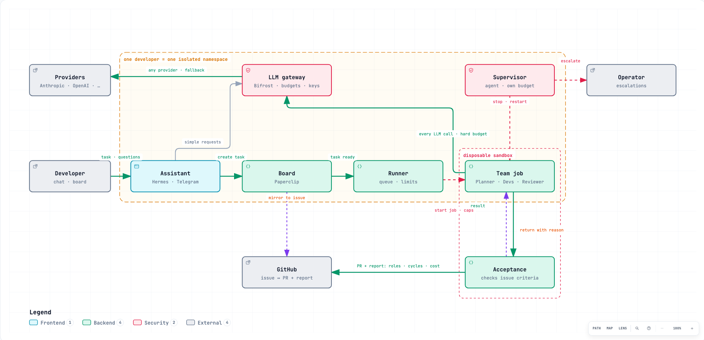

#  AI-cloud-team

**A managed AI development team for every developer in your organization — running in your cloud, on any coding agent, with a bill you can read.**

Coding agents are cheap to try and expensive to run for a team: shared keys, invoices nobody can attribute, and loops that burn money overnight. ai-cloud-team gives each developer an isolated team of agents (planner, developers, reviewer, acceptance) watched by a separate supervisor, and puts into every pull request who did the work, how many cycles it took, and what it cost.

<picture>
  <source media="(prefers-color-scheme: dark)" srcset="architecture-dark.png">
  
</picture>

It is open, self-hostable on Kubernetes, and orchestrates third-party agents (Claude Code, Codex, DeepSeek Harness) instead of shipping its own.

> Status: early development. Nothing below is a promise about the future — features marked *planned* do not exist yet.

## What an organization gets

1. **One isolated team per developer.** Each developer gets their own Kubernetes namespace: own secrets, own memory, own budget, default-deny network. Developer A cannot read developer B's context or spend their money. Revoking someone's access is one command.
2. **A cost and process report in every PR.** Which roles and models did the work, how many plan → code → review → accept cycles it took, what the reviewer sent back and why, whether the supervisor intervened, and what it cost — per role and in total. The organization sees who did the work, not "AI did it".
3. **Any agent under the hood.** Claude Code, Codex and DeepSeek Harness are swappable per role. Provider keys live only in the gateway (Bifrost); agents never see them. Switching provider is a flag, not a migration.
4. **Budgets enforced by code.** Every LLM call carries a virtual key with a hard limit; every agent job has `--max-budget-usd`, `--max-turns` and a wall-clock deadline. No prompt asks the model to be frugal — the infrastructure refuses the call.
5. **A supervisor outside the team.** A separate, cheap agent with its own small budget watches the working team: detects loops and stops them before the budget burns, restarts with a different strategy or harness, repairs infrastructure (dead job, stale poller, provider 429), and escalates to a human with a short account of what was tried, where it stalled, and what it cost.
6. **Acceptance against the issue, not against green tests.** A dedicated role checks the result against the acceptance criteria written in the issue and returns it with a reason if it doesn't deliver. We will publish our own accepted-without-edits rate once we have one; until then this is a design goal, not a claim.
7. **Same delivery, your cloud or ours.** One Helm chart. Run it in your cluster or use the hosted version (*planned*).

## How it works

A task appears on the board (Paperclip) and is mirrored to a GitHub issue. A developer creates it from chat (Hermes Agent, Telegram) or directly on the board.

| Role | Does | Model tier |
|---|---|---|
| Acceptance owner | Reads the issue, writes acceptance criteria, accepts or returns the final result | strong, few tokens |
| Planner | Breaks the task into steps, asks the developer one question when a mistake would be expensive | strong, few tokens |
| Developers | Write code and tests in a disposable sandbox (Kubernetes Job: no root, read-only FS, network only to the gateway) | cheap, many tokens, parallel |
| Reviewer | Reviews the PR and runs tests — on a *different* provider than the developers | mid |
| Supervisor | Watches all of the above from outside the team | cheap |

Output: a pull request with the report described in (2).

## What it is not

- Not a coding agent. We run Claude Code, Codex and DeepSeek Harness; we don't replace them.
- Not a chat UI or a skills marketplace.
- Not "local AI": the team runs on cloud models through one gateway. A local model can be plugged in as one more provider.
- Not a way to use personal Claude/ChatGPT subscriptions for automation. API keys under commercial terms only.

## Why not something that exists

| | Closest to us in | Why it wasn't enough |
|---|---|---|
| Factory Droids, Devin | roles, issue → PR, on-prem option | their own agent, closed; no per-developer tenancy on your cluster |
| Gas Town, Agent Orchestrator, Superset | orchestrating third-party agents, watchdogs | one person on one laptop; no budgets, isolation or org model |
| Symphony (OpenAI) | board-driven issue → PR | single agent per issue, Linear only, unmaintained |
| OpenHands | self-hosted on Kubernetes, any provider | one agent; no roles, supervision or tenancy |
| Paperclip | board, org chart, budgets | we use it as the state engine; it has no isolation, sandbox or cross-provider review |
| Hermes Agent, OpenClaw | chat front-end with memory | Hermes is our front-end; OpenClaw's trust model is one operator on one machine |
| LoopGain, pi-watchdog-supervisor, AgentWatch | loop detection | libraries, not a supervisor with a budget inside a multi-tenant platform |

Every piece above exists. What didn't exist is the combination an organization needs: per-developer isolation on its own cluster, any agent underneath, and a readable account of cost and process in every PR.

## Honest risks

DeepSeek Harness is alpha and breaks between versions — we pin and keep plain Claude Code as fallback. Paperclip had a CVSS 10.0 RCE in August 2026 — it runs behind default-deny network policy with no public port. The acceptance role can degrade into decoration if its output isn't measured — we log accepted/returned with reasons from day one. The supervisor costs money too and is capped by the same code as everyone else. You need a Kubernetes cluster.

## Metrics we will publish

Once the platform reaches its roadmap milestones, we will build a small public product with it end to end — every PR, decision and cost visible — and report these numbers from that project (*planned*).

- PRs accepted by a human without edits, %
- Cost per accepted PR, $
- Tasks stopped by the supervisor before 50 % of budget
- Time to recover a stalled task
- Tasks that exceeded their cap: must stay 0

## Repositories

- `platform` — Helm chart, Terraform module, services, evals (private until stage 1)
- `docs` — user documentation and FAQ
- `.github` — this page, templates, reusable workflows
